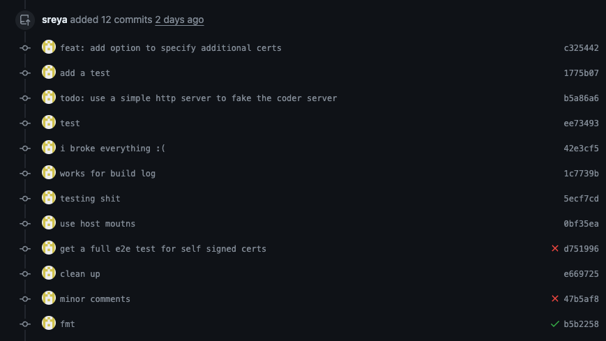

# aicommit

`aicommit` is a small command line tool for generating commit messages. There
are many of these already out there, some even with the same name. But none
(to my knowledge) follow the repository's existing style, making
them useless when working in an established codebase.

A good commit message is more than a summary of the code changes. It contains
the intention, context, and external references that help others understand the
change. Thus, `aicommit` has a `-c`/`--context` flag for quickly adding
this detail.

`aicommit` is inspired by our good friend [@sreya](https://github.com/sreya):




## Install

Via Homebrew:
```
brew install aicommit
```

Or, using Go:

```
go install github.com/coder/aicommit/cmd/aicommit@main
```

Or, download a binary from [the latest release](https://github.com/coder/aicommit/releases).

## Usage

You can run `aicommit` with no arguments to generate a commit message for the
staged changes.

```bash
export OPENAI_API_KEY="..."
aicommit
```

You can "retry" a commit message by using the `-a`/`--amend` flag.

```bash
aicommit -a
```

You can dry-run with `-d`/`--dry` to see the ideal message without committing.

```bash
aicommit -d
```

Or, you can point to a specific ref:

```bash
aicommit HEAD~3
```

You can also provide context to the AI to help it generate a better commit message:

```bash
aicommit -c "closes #123"

aicommit -c "improved HTTP performance by 50%"

aicommit -c "bad code but need for urgent customer fix"
```

When tired of setting environment variables, you can save your key to disk:

```bash
export OPENAI_API_KEY="..."
aicommit --save-key
# The environment variable will override the saved key.
```

## Style Guide

`aicommit` will read the `COMMITS.md` file in the root of the repository to
determine the style guide. It is optional, but if it exists, it will be followed
even if the rules there diverge from the norm.

If there is no repo style guide, `aicommit` will look for a user style guide
in `~/COMMITS.md`.

## Other Providers

You may set `OPENAI_BASE_URL` to use other OpenAI compatible APIs with `aicommit`.
So far, I've tested it with [LiteLLM](https://github.com/BerriAI/litellm) across
local models (via ollama) and Anthropic. I have yet to find a local model
that is well-steered by the prompt design here, but the Anthropic Claude 3.5
commit messages are on par with 4o. My theory for why local models don't work well
is (even the "Instruct" fine-tuned models) have much worse instruction
fine-tuning than the flagship commercial models.